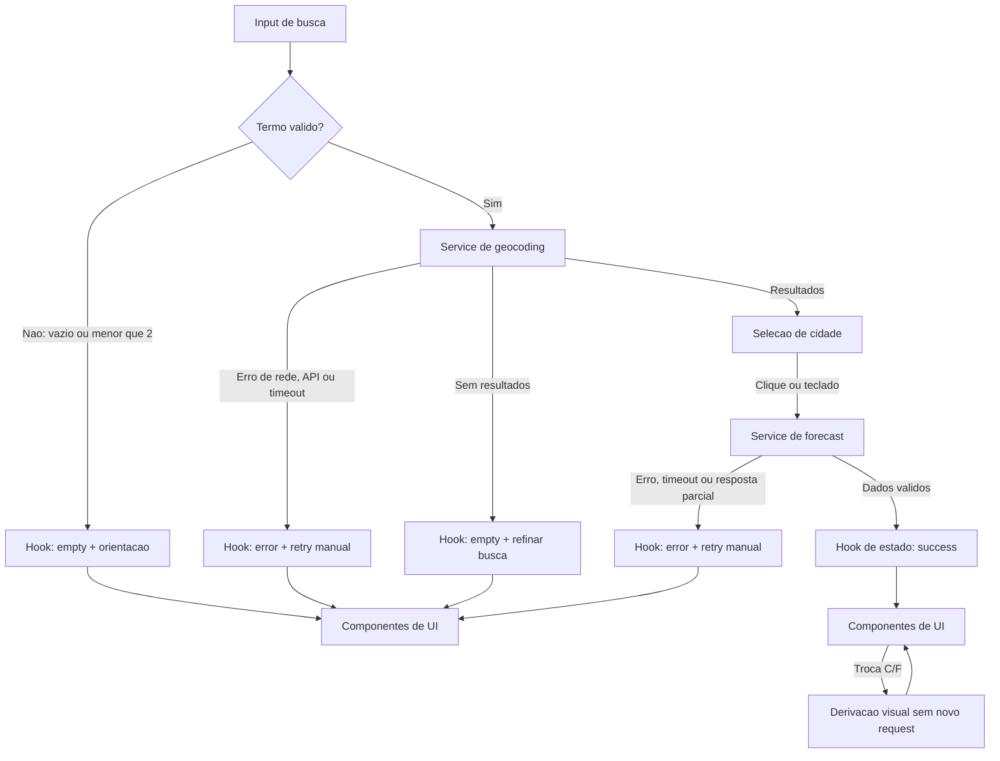

# Architecture

## Visão geral

Arquitetura React simples, orientada a fluxo, com uma rota única e quatro
camadas com dependências em uma única direção:

1. **Apresentação (`components/`):** recebe estado e callbacks, renderiza o
  formulário, resultados, clima, previsão, unidade e mensagens acessíveis.
2. **Orquestração (`hooks/`):** coordena busca, seleção, forecast, requestId,
  loading, erro, retry e projeção da unidade, sem markup ou chamadas diretas
  espalhadas pelos componentes.
3. **Acesso a dados (`services/`):** encapsula URLs, parâmetros, Fetch API,
  timeout, validação das respostas externas e mapeamento inicial de erros.
4. **Funções puras (`lib/`):** contém conversão de temperatura, mapeamento WMO,
  transformação de arrays diários e formatação de datas, sem rede, estado ou
  efeitos colaterais.

O fluxo de dependência é `components -> hooks -> services/lib` e
`services -> lib/types`. `lib` e `types` não importam React; `services` não
conhece componentes; e `components` não acessa a Open-Meteo diretamente.

 O fluxo principal é: busca explícita -> geocoding -> seleção explícita (quando
 necessária) -> forecast -> validação e transformação -> renderização na mesma
 rota. A aplicação não terá login, histórico, favoritos, geolocalização,
 offline, polling, cache persistente ou atualização automática.

## Fronteiras e concorrência

- Cada operação recebe um `requestId` crescente.
- Uma nova busca invalida a operação anterior; a implementação pode abortá-la,
  mas deve obrigatoriamente descartar qualquer resposta cujo `requestId` não
  seja o atual.
- A seleção de localidade inicia o forecast somente para a localidade
  selecionada.
- Dados anteriores podem continuar visíveis durante um novo carregamento, mas
  devem ser marcados como não atuais e nunca combinados com dados parciais da
  resposta nova.

# Tech Stack

- **TypeScript strict + React + Vite:** atende ao stack definido e permite
  contratos determinísticos para estados e transformações.
- **Tailwind CSS:** implementa o layout mobile-first, o tema dark glassmorphism
  e os estados visuais sem criar uma camada de estilo adicional.
- **Fetch API:** suficiente para as duas integrações HTTP sem dependência de
  cliente complexo.
- **Vitest + Testing Library:** cobre funções puras, componentes, estados e
  acessibilidade observável.
- **Playwright:** verifica fluxos completos nos viewports definidos.
- **Biome:** lint e formatação do projeto.
- **pnpm:** gerenciador definido para instalação e scripts.

O plano não adiciona biblioteca de gerenciamento global, cache ou validação de
schemas: o estado é local à tela e a validação necessária fica nos serviços,
mantendo o MVP pequeno e substituível.

# Project Structure

```text
src/
  components/
    SearchForm.tsx
    LocationResults.tsx
    CurrentWeather.tsx
    DailyForecast.tsx
    UnitToggle.tsx
    StatusMessage.tsx
  hooks/
    useWeatherSearch.ts
  services/
    geocodingService.ts
    forecastService.ts
    http.ts
  types/
    weather.ts
    api.ts
  lib/
    temperature.ts
    weatherCode.ts
    date.ts
    weatherMapper.ts
tests/
  unit/
  components/
  e2e/
```

Os diretórios principais de `src/` são `components/`, `hooks/`, `services/` e
`lib/`; `types/` complementa os contratos compartilhados entre as camadas.

Responsabilidades:

- `components/`: markup semântico, labels, foco, apresentação e interação;
  cada componente deve ter uma responsabilidade visual clara. Seus testes
  usam mocks de callbacks e serviços, sem rede real.
- `hooks/`: orquestração do fluxo de busca/seleção, requestId, loading, erro e
  retry; não contém regras de apresentação.
- `services/`: construção de URLs, chamadas Open-Meteo, timeout, tratamento de
  HTTP/JSON e contratos de entrada/saída. Seus testes mockam `fetch` e validam
  parâmetros, erros e respostas inválidas.
- `types/`: tipos compartilhados dos modelos de domínio e respostas externas.
- `lib/`: funções puras de conversão, mapeamento WMO, transformação dos dados
  e formatação de data. Seus testes recebem entradas e comparam saídas, sem
  ambiente React ou rede.
- `tests/`: testes unitários e de componentes próximos aos contratos, além dos
  fluxos E2E de cada história relevante.

Essa separação reduz retrabalho porque mudanças na API ficam em `services`,
mudanças de regra ficam em `lib`, mudanças de fluxo ficam em `hooks` e ajustes
visuais ficam em `components`. Cada camada pode ser testada isoladamente e os
testes E2E ficam reservados para validar o fluxo integrado nos viewports da
spec.

# Data Model

Os contratos abaixo descrevem dados e estados; não são implementação.

```ts
type Unit = 'celsius' | 'fahrenheit';
type LoadStatus = 'idle' | 'loading' | 'empty' | 'success' | 'error';
type SearchStatus = 'idle' | 'loading' | 'success' | 'empty' | 'error';

interface City {
  id?: number; // Identificador Open-Meteo da localidade.
  name: string; // Nome da cidade.
  country?: string; // País retornado pelo geocoding.
  region?: string; // Estado ou região administrativa.
  latitude: number; // Latitude usada no forecast.
  longitude: number; // Longitude usada no forecast.
  timezone?: string; // Fuso horário da localidade.
}

interface CurrentWeather {
  time: string; // Horário local da medição, retornado por current.time.
  temperatureCelsius: number; // Temperatura de current.temperature_2m.
  apparentTemperatureCelsius: number; // Sensação de current.apparent_temperature.
  weatherCode: number; // Código WMO de current.weather_code.
  humidityPercent?: number; // Umidade relativa em current.relative_humidity_2m.
  windSpeedKmh?: number; // Velocidade em km/h de current.wind_speed_10m.
  precipitationMm?: number; // Precipitação em mm de current.precipitation.
}

interface ForecastDay {
  date: string; // Data local de daily.time.
  weatherCode: number; // Código WMO de daily.weather_code.
  minimumTemperatureCelsius: number; // Mínima de daily.temperature_2m_min.
  maximumTemperatureCelsius: number; // Máxima de daily.temperature_2m_max.
  precipitationMm?: number; // Acumulado em mm de daily.precipitation_sum.
  precipitationProbabilityPercent?: number; // Probabilidade máxima em %.
}

interface WeatherData {
  city: City; // Localidade selecionada pelo usuário.
  timezone: string; // Fuso usado para interpretar as datas locais.
  current: CurrentWeather; // Condições atuais da localidade.
  forecast: ForecastDay[]; // Exatamente cinco dias, hoje + quatro dias.
}

interface SearchState {
  status: SearchStatus;
  query: string;
  results: City[];
  selectedCity?: City;
}

interface WeatherState {
  status: LoadStatus;
  data?: WeatherData;
  isCurrent: boolean;
  error?: UserFacingError;
  retryCount: number;
  unit: Unit;
  requestId: number;
}

interface UserFacingError {
  kind:
    | 'invalid-query'
    | 'not-found'
    | 'network'
    | 'api'
    | 'timeout'
    | 'partial-response';
  message: string;
  canRetry: boolean;
}
```

Temperatura, sensação térmica, código meteorológico e data são essenciais.
Umidade, vento, precipitação e probabilidade de precipitação são opcionais:
quando ausentes ou inválidos, devem aparecer como `—` ou ser omitidos de modo
explícito, sem valor inventado. O clima atual usa `temperature_2m` e
`apparent_temperature`; o diário usa os arrays alinhados pelo mesmo índice.

Contratos puros de domínio:

```ts
type WeatherLabel = string;

function celsiusToFahrenheit(celsius: number): number;
function formatTemperature(value: number, unit: Unit): string;
function weatherCodeToLabel(code: number): WeatherLabel;
function transformForecastResponse(
  city: City,
  response: ForecastApiResponse,
): WeatherData;
```

`celsiusToFahrenheit` aplica `F = (C * 9 / 5) + 32` e arredonda para uma casa
decimal. A conversão cobre temperatura e sensação atuais e mínimas/máximas
diárias, sem alterar os dados Celsius originais.

# Data Flow

1. O estado interno começa em `idle`, sem localidade presumida e com Celsius;
  a apresentação desse estado é a tela vazia orientando a primeira busca.
2. O usuário envia o formulário explicitamente. Termo vazio, somente espaços
   ou com menos de 2 caracteres não chama a API e exibe orientação em pt-BR.
3. O hook normaliza apenas espaços necessários, cria um novo `requestId`, zera
   o retry da operação e coloca a busca em `loading`. O indicador deve surgir
   em até 100 ms.
4. O serviço de geocoding consulta no máximo cinco localidades. Zero resultados
   produz `not-found`, sem chamada ao forecast. Um ou mais resultados são
   exibidos com nome, região/estado, país, latitude e longitude quando
   disponíveis.
5. A seleção por clique ou teclado define uma única localidade. O clima só é
  consultado após a seleção quando houver múltiplos resultados; para resultado
  único, o fluxo seleciona automaticamente esse resultado antes de seguir.
6. O serviço de forecast inicia `loading`, preservando dados anteriores apenas
   com marcação `isCurrent: false`. HTTP não-OK, JSON inválido, timeout ou
   ausência de essenciais produz erro técnico/de dados.
7. A transformação usa `timezone=auto`, mantém exatamente cinco datas de
   `daily.time[0]` a `daily.time[4]` e apresenta-as como datas locais pt-BR.
8. O sucesso exibe localidade, clima atual e previsão na mesma rota. Condições
   usam rótulos WMO em pt-BR e fallback textual para código desconhecido.
9. A alternância de unidade transforma somente a projeção visual em memória;
   nunca dispara geocoding ou forecast. Se ocorrer durante loading, aplica-se
   quando os dados chegarem.
10. Em qualquer resolução, somente o `requestId` vigente pode alterar o estado.

Meta de desempenho: no cenário com respostas mockadas, o resultado deve
renderizar em até 2 s após a ação.

Diagrama do fluxo de dados e dos estados de erro/vazio:



# External APIs

## Geocoding

Endpoint: `GET https://geocoding-api.open-meteo.com/v1/search`.

Parâmetros obrigatórios:

```ts
interface GeocodingQuery {
  name: string;
  count: 5;
  language: 'pt';
  format: 'json';
}
```

`name` recebe cidade e refinamento opcional por estado/região e país conforme
o texto/controles da busca. A resposta deve ser validada antes de virar
`City`; cada item precisa de nome, latitude e longitude, enquanto país e
região podem ser exibidos quando disponíveis.

Exemplo resumido de resposta:

```json
{
  "results": [
    {
      "id": 3451190,
      "name": "Sao Paulo",
      "latitude": -23.55,
      "longitude": -46.63,
      "country": "Brazil",
      "admin1": "Sao Paulo",
      "timezone": "America/Sao_Paulo"
    }
  ]
}
```

Mapeamento para `City`: `id` -> `id`, `name` -> `name`, `country` ->
`country`, `admin1` -> `region`, `latitude` -> `latitude`, `longitude` ->
`longitude` e `timezone` -> `timezone`. `results` ausente ou vazio representa
busca sem resultados; `name`, `latitude` e `longitude` ausentes tornam a
resposta invalida.

## Forecast

Endpoint: `GET https://api.open-meteo.com/v1/forecast`.

Parâmetros obrigatórios:

```ts
interface ForecastQuery {
  latitude: number;
  longitude: number;
  current: 'temperature_2m,apparent_temperature,relative_humidity_2m,wind_speed_10m,precipitation,weather_code';
  daily: 'time,weather_code,temperature_2m_min,temperature_2m_max,precipitation_sum,precipitation_probability_max';
  temperature_unit: 'celsius';
  forecast_days: 5;
  timezone: 'auto';
}
```

Contratos das respostas externas:

```ts
interface GeocodingApiResponse {
  results?: GeocodingApiResult[];
}

interface GeocodingApiResult {
  id?: number;
  name: string;
  country?: string;
  admin1?: string;
  latitude: number;
  longitude: number;
  timezone?: string;
}

interface ForecastApiResponse {
  timezone: string;
  current?: {
    time?: string;
    temperature_2m?: number;
    apparent_temperature?: number;
    relative_humidity_2m?: number;
    wind_speed_10m?: number;
    precipitation?: number;
    weather_code?: number;
  };
  daily?: {
    time?: string[];
    weather_code?: number[];
    temperature_2m_min?: number[];
    temperature_2m_max?: number[];
    precipitation_sum?: number[];
    precipitation_probability_max?: number[];
  };
}
```

Exemplo resumido de resposta:

```json
{
  "timezone": "America/Sao_Paulo",
  "current": {
    "time": "2026-09-16T10:00",
    "temperature_2m": 22.4,
    "apparent_temperature": 22.1,
    "relative_humidity_2m": 68,
    "wind_speed_10m": 11.5,
    "precipitation": 0,
    "weather_code": 2
  },
  "daily": {
    "time": ["2026-09-16", "2026-09-17"],
    "weather_code": [2, 61],
    "temperature_2m_min": [17.2, 16.8],
    "temperature_2m_max": [25.1, 22.4],
    "precipitation_sum": [0, 4.2],
    "precipitation_probability_max": [10, 70]
  }
}
```

O exemplo mostra apenas dois dias para ser legivel; a resposta de producao
deve conter exatamente cinco itens em cada array diario. O mapeamento para
`WeatherData` e feito assim:

- `timezone` -> `WeatherData.timezone`.
- `City` selecionada -> `WeatherData.city`.
- `current.time` -> `CurrentWeather.time`.
- `current.temperature_2m` -> `CurrentWeather.temperatureCelsius`.
- `current.apparent_temperature` ->
  `CurrentWeather.apparentTemperatureCelsius`.
- `current.weather_code` -> `CurrentWeather.weatherCode`.
- `current.relative_humidity_2m`, `wind_speed_10m` e `precipitation` -> os
  campos opcionais correspondentes de `CurrentWeather`.
- Para cada indice `i` de 0 a 4, `daily.time[i]`, `weather_code[i]`,
  `temperature_2m_min[i]` e `temperature_2m_max[i]` formam um `ForecastDay`.
  `precipitation_sum[i]` e `precipitation_probability_max[i]` preenchem os
  campos opcionais do mesmo dia.

Os valores recebidos com `temperature_unit=celsius` permanecem como fonte
canonica em Celsius. A unidade Fahrenheit e uma projecao da UI, calculada sem
nova chamada a este endpoint.

Os serviços devem impor timeout de 10 s. Não há retry automático. Cada erro
deve conservar a operação necessária para o botão de retry manual, limitado a
um máximo de 2 retries manuais (maximum 2 manual retries), sem exceder esse
limite.

# State Management

O estado da tela vive exclusivamente no hook de orquestração (`useWeatherSearch`),
sem store global, contexto adicional ou persistência. O componente raiz fornece
estado e callbacks aos componentes de apresentação; componentes visuais não
fazem chamadas à API nem alteram diretamente os dados brutos.

Estados explícitos da tela:

- **`idle`:** a aplicação está pronta, mas nenhuma busca foi iniciada; exibe o
  formulário sem resultados ou mensagem de erro.
- **`loading`:** geocoding ou forecast está em andamento; exibe indicador em
  até 100 ms, região `aria-live` e `aria-busy`. Dados anteriores, se mantidos,
  recebem `isCurrent: false`.
- **`empty`:** não há conteúdo meteorológico para exibir, seja na abertura ou
  após geocoding sem resultados; orienta pesquisar/refinar sem presumir uma
  localidade.
- **`success`:** há uma `City` selecionada e `WeatherData` válido com clima
  atual e exatamente cinco dias.
- **`error`:** a operação falhou; exibe mensagem pt-BR, preserva a consulta
  útil e oferece retry apenas para erros repetíveis.

O estado de busca pode distinguir `idle`, `loading`, `success`, `empty` e
`error`; o estado meteorológico usa os mesmos estados e mantém `data` anterior
se ela ainda for útil, sempre marcada como não atual durante novo carregamento.

Conversão derivada na renderização:

- A API sempre é chamada com `temperature_unit=celsius`; Celsius é a fonte
  canônica armazenada em `WeatherData`.
- `unit` começa em `'celsius'` e vive apenas em memória durante a sessão da
  página. O controle de unidade altera somente esse valor no hook.
- Componentes ou um seletor de apresentação chamam a função pura
  `formatTemperature(valueCelsius, unit)`, que aplica `F = (C * 9 / 5) + 32`
  e arredonda para uma casa decimal quando `unit` é `'fahrenheit'`.
- A projeção cobre temperatura e sensação atuais e mínimas/máximas diárias;
  não altera os valores Celsius originais e não chama geocoding nem forecast.
- Se a unidade mudar durante `loading`, a preferência fica registrada e é
  aplicada aos dados quando o estado mudar para `success`.

Transições e invariantes:

- Uma busca válida sai de `idle`/`empty` para `loading`; sucesso vai para
  `success`; zero resultados vai para `empty`; falha vai para `error`.
- Retry incrementa `retryCount` até 2, repete a última operação válida e gera
  novo `requestId`.
- Nova busca zera seleção e retry relativos à operação anterior e invalida suas
  respostas.
- Apenas respostas completas e válidas podem entrar em `success`.
- Não há estado para histórico, favoritos, offline ou atualização automática.

# Error Handling

Os serviços normalizam falhas em categorias com comportamento definido:

- **`invalid-query`:** entrada vazia, apenas espaços ou menos de dois
  caracteres; não cria request e mantém `idle` ou `empty` com orientação.
- **`not-found`:** geocoding respondeu sem resultados; vai para `empty`, permite
  editar/refinar o termo e não inicia forecast.
- **`network`:** falha de conexão, DNS ou perda de conectividade; vai para
  `error`, informa indisponibilidade temporária e oferece retry manual.
- **`api`:** HTTP não-OK, JSON inválido ou erro explícito da API; vai para
  `error`, preserva a operação repetível e oferece retry manual.
- **`timeout`:** a requisição excedeu 10 segundos; encerra loading, vai para
  `error` e oferece retry manual sem deixar spinner infinito.
- **`partial-response`:** faltam campos essenciais atuais ou os cinco arrays
  diários não estão alinhados; vai para `error`, não exibe o resultado como
  sucesso e informa indisponibilidade dos dados. Campos opcionais ausentes
  exibem `—` ou são omitidos explicitamente.

O retry é visível somente para `network`, `api`, `timeout` e, quando a operação
puder ser repetida com segurança, `partial-response`; é sempre manual e totaliza
no máximo duas novas tentativas. Respostas atrasadas, inclusive de tentativas
anteriores, são descartadas pelo `requestId`. O erro não deve apagar uma busca
ou localidade úteis, mas nunca deve apresentar dados parciais como atuais.

Acessibilidade faz parte do tratamento de estado: mensagens de carregamento,
vazio e erro mudam em regiões `aria-live`; controles têm labels/nome acessível,
foco visível, ordem de teclado coerente e não dependem apenas de cor ou ícone.
O contraste mínimo é 4,5:1 para texto normal.

# Testing Strategy

## Vitest e Testing Library

- **Funções puras em `lib/`:** testar conversão Celsius/Fahrenheit, fórmula,
  arredondamento para uma casa decimal, valores negativos, mapeamento de todos
  os códigos WMO suportados, fallback de código desconhecido, formatação de
  datas e transformação dos arrays `daily` em cinco `ForecastDay`.
- **Services:** mockar `fetch` e verificar URL, parâmetros, `forecast_days=5`,
  `timezone=auto`, `temperature_unit=celsius`, parsing, validação de campos,
  HTTP não-OK, JSON inválido, timeout de 10 segundos e ausência de retry
  automático. Testar que respostas incompletas produzem `partial-response`.
- **Hooks/orquestração:** testar as transições `idle -> loading -> success`,
  `loading -> empty` e `loading -> error`, retry manual até 2, preservação da
  busca, descarte de respostas fora de ordem por `requestId` e troca de unidade
  sem nova chamada.
- **Componentes com Testing Library:** testar `SearchForm`, `LocationResults`,
  `CurrentWeather`, `DailyForecast`, `UnitToggle` e `StatusMessage` nos estados
  `idle`, `loading`, `empty`, `error` e `success`. Verificar labels, teclado,
  foco, `aria-live`, `aria-busy`, mensagens em pt-BR e conteúdo sem depender
  apenas de cor ou ícone.

Os testes unitários e de componentes não devem depender de rede real. Cada
cenário deve usar fixtures pequenas e determinísticas, com uma fixture válida,
uma sem resultados, uma resposta parcial e falhas de rede/API/timeout.

## Playwright

- Executar os fluxos E2E de busca válida, seleção de cidade homônima, cidade não
  encontrada, sucesso com previsão de cinco dias, troca C/F sem nova chamada,
  loading, erro técnico e retry.
- Interceptar as requisições Open-Meteo para controlar respostas e verificar que
  a unidade não dispara novo forecast, que timeout/error sai do loading e que
  respostas antigas não substituem a busca atual.
- Repetir os fluxos principais nos viewports de 320 px (mobile prioritário),
  768 px (tablet) e 1280 px (desktop). No mobile, verificar ausência de
  sobreposição e rolagem horizontal, leitura da previsão e operação por teclado.
- Validar estados acessíveis com roles, nomes acessíveis, foco visível e
  anúncios das regiões `aria-live`; contrastes devem ser verificados por uma
  checagem automatizada complementar quando disponível.

## Rastreabilidade por User Story

| História | Módulos/tarefas implementáveis | Testes mínimos |
|---|---|---|
| US1 — Busca rápida | `SearchForm`, `LocationResults`, `geocodingService`, fluxo de validação, limite de 5, refinamento e seleção por teclado | Componente: submissão válida e inválida; unidade: parâmetros e normalização; E2E: AC1, AC2 e AC8 |
| US2 — Clima atual | `CurrentWeather`, transformação de `current`, rótulos WMO e opcionais | Unidade: campos essenciais/opcionais e fallback WMO; componente/E2E: AC3 e AC11 |
| US3 — Planejamento da semana | `DailyForecast`, transformação dos arrays, datas no timezone local | Unidade: cinco índices alinhados; E2E: AC4 com cinco datas consecutivas |
| US4 — Diferentes dispositivos | layout dos componentes e semântica/foco | Playwright em 320, 768 e 1280 px; teclado, ausência de sobreposição/rolagem horizontal e AC10/AC11 |
| US5 — Preferência de unidade | `UnitToggle`, `temperature.ts`, projeção de unidade no estado | Unidade: fórmula e uma casa decimal; componente/E2E: todos os campos convertidos e zero chamadas API, AC5 |
| US6 — Recuperação de falha | `StatusMessage`, timeout/retry no hook e serviços | Unidade: HTTP, JSON, timeout, dados incompletos e limite de retries; E2E: AC6, AC7 e AC9 |

## Cobertura técnica

- Mockar `fetch` nos testes Vitest para verificar URLs e todos os parâmetros
  Open-Meteo; interceptar requests no Playwright para validar o fluxo integrado.
- Testar respostas fora de ordem: a resposta antiga nunca substitui a mais
  recente.
- Testar loading visível em até 100 ms e renderização mockada em até 2 s.
- Testar teclado, nomes acessíveis, `aria-live`, foco visível e contraste por
  inspeção automatizada e validação E2E.
- Executar `pnpm lint`, `pnpm build`, `pnpm test` e `pnpm test:e2e` antes da
  entrega, além da suíte Playwright para os viewports de compatibilidade.

# Risks & Trade-offs

| Decisão/risco | Trade-off e mitigação |
|---|---|
| Estado local em vez de store global | Menos complexidade e suficiente para uma rota; mantém o fluxo explícito, mas exigirá elevar estado se o escopo crescer. |
| `requestId` e descarte de respostas | Evita dados fora de ordem sem depender de cancelamento perfeito; respostas canceladas ainda podem consumir rede. |
| Forecast somente após seleção | Evita clima da cidade errada em homônimos; adiciona um passo deliberado ao fluxo de busca. |
| Celsius na API e conversão local | Uma fonte numérica estável e zero chamadas ao trocar unidade; exige testes rigorosos da fórmula e arredondamento. |
| Sem cache persistente | Evita dados obsoletos e comportamento fora do escopo; latência depende do Open-Meteo, mitigada por loading imediato e retry manual. |
| Timeout fixo de 10 s e no máximo 2 retries | Protege contra spinner infinito e loops; uma API indisponível continuará indisponível e deve ser comunicada claramente. |
| Dados opcionais como `—` | Preserva honestidade da fonte e acessibilidade; a tela pode ter lacunas visuais. |
| `timezone=auto` e datas retornadas pela API | Mantém o calendário local da localidade, inclusive virada de data; exige alinhar arrays por índice e não pelo relógio do navegador. |
| Layout mobile-first em rota única | Cumpre consulta sem navegação adicional e prioriza 320 px; a previsão pode exigir rolagem vertical, nunca horizontal. |

## Alternativas consideradas

- **Store global (Redux/Zustand) vs. estado no hook:** a store foi rejeitada
  porque o MVP tem uma rota e um único fluxo; `useWeatherSearch` reduz
  boilerplate. Uma store só deve ser reavaliada se surgirem múltiplas telas ou
  estado compartilhado persistente.
- **Cliente HTTP externo vs. Fetch API:** um cliente externo foi rejeitado
  porque as duas integrações são simples; `fetch` mantém dependências e mocks
  menores. A troca continua localizada em `services/http.ts`.
- **Schema validator externo vs. validação nos services:** uma biblioteca como
  Zod não é necessária para o contrato pequeno; validações explícitas evitam
  dependência adicional. Deve ser reconsiderada se a API crescer ou tiver
  múltiplas versões.
- **Cache persistente vs. sem cache:** o cache foi rejeitado no MVP para evitar
  dados obsoletos e testes dependentes de estado anterior; o custo é depender
  da latência da API, mitigado por loading imediato.
- **Testes E2E reais contra Open-Meteo vs. requests interceptados:** requests
  reais não são determinísticos e podem sofrer rate limiting; interceptação no
  Playwright torna os fluxos reproduzíveis. Uma verificação manual da API pode
  ser feita separadamente, sem fazer parte da suíte obrigatória.
| Mapeamento WMO com fallback textual | Torna a condição compreensível sem depender de ícone; códigos novos da API podem aparecer com rótulo genérico até atualização do mapa. |

Riscos operacionais principais são indisponibilidade/rate limiting do Open-Meteo,
dados inconsistentes, regressões de acessibilidade e layout inadequado em telas
estreitas. A integração isolada, validação de contratos, testes de concorrência,
testes de contraste/teclado e execução nos três viewports limitam esses riscos.